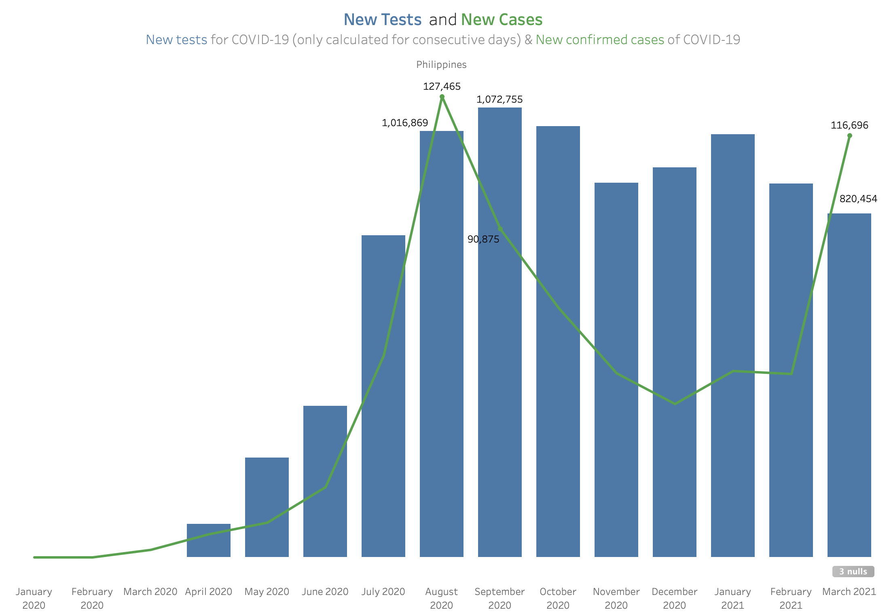
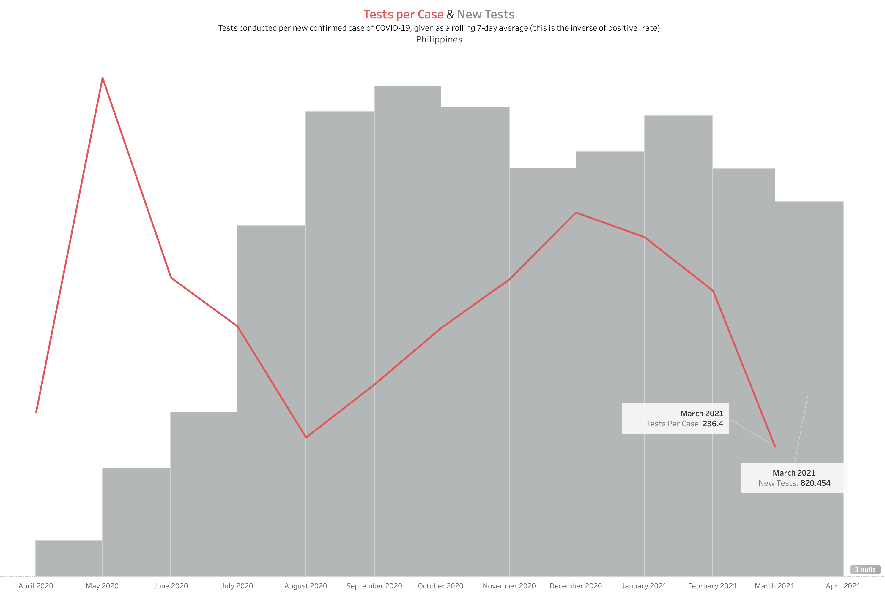
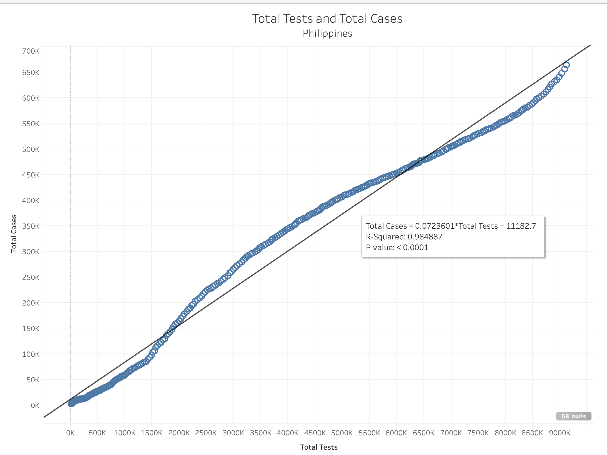
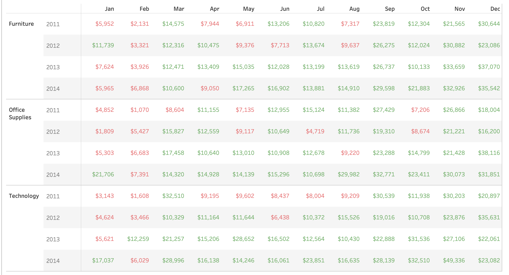
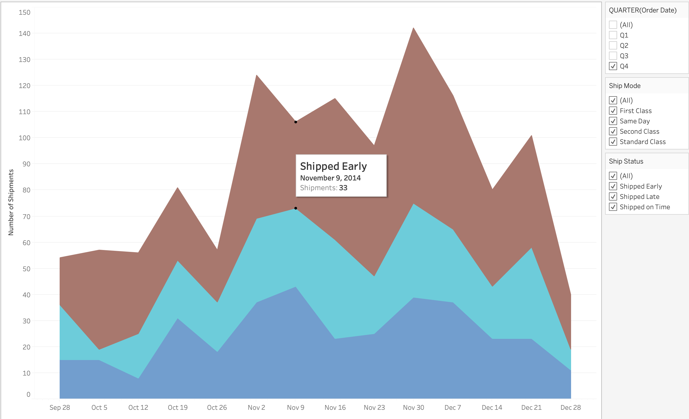
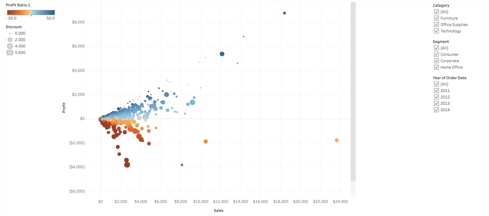
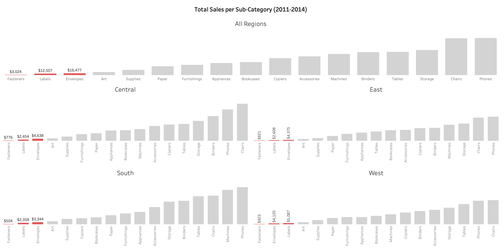
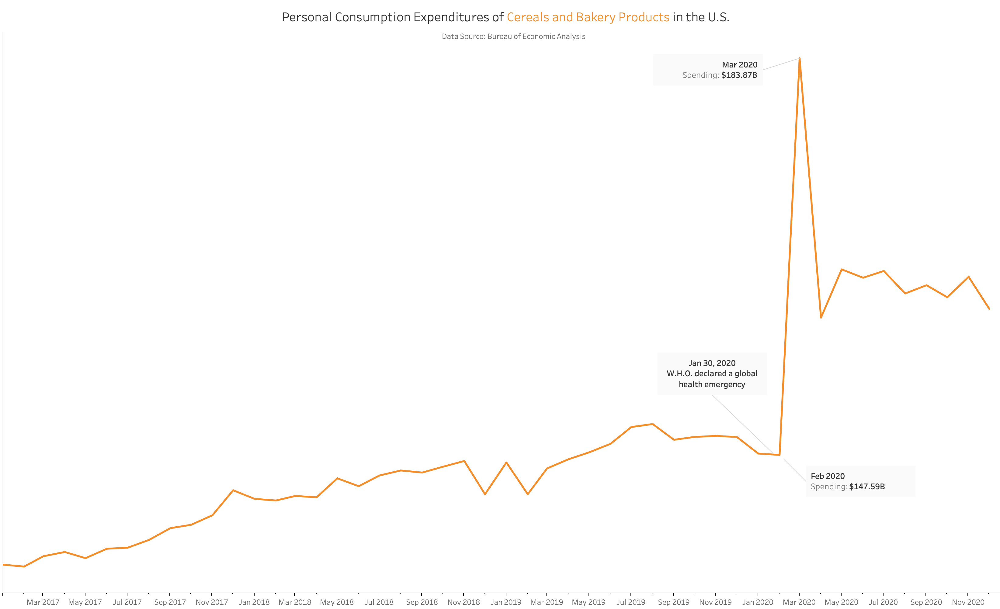
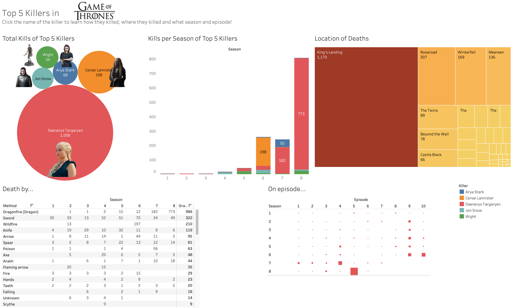

## Data Visualizations

Here is a portfolio of data visualizations I made with Tableau

--------------------------------
### Philippine COVID-19 Visualizations

The dataset for these visualizations came from [Our World in Data](https://github.com/owid/covid-19-data/tree/master/public/data/).
The dataset was downloaded on March 26, 2021.
If anything is amiss with the visualizations, [please let me know](mailto:francisilustre@gmail.com)!

 Philippines: New Tests and New Cases 

This graph shows that the New Cases for March 2021 is close to the maximum New Cases which happened last August 2020.
At the same time, it shows that the number of New Tests declined, increasing the gap between the two variables. Unfortunately, the value of the New Cases is way above the New Tests.

 Philippines: Tests per Case and New Tests 

This graph primarily shows that the Tests per Case is at its lowest since the beginning of the Pandemic. It takes a lower number
of tests before a new case happens. On the background is the New Tests as a bar chart to reiterate that the New Tests declined.

 Philippines: Total Tests and Total Cases 

This scatter plot shows a positive relationship between Total Tests and Total Cases. The R^2 of the trend line is 0.984, indicating a strong relationship
between the two variables.

If testing is increased, we would have a clearer data on how many are really infected with COVID-19 in the Philippines. 

--------------------------------
### Superstore Sales Spotlight

This is a visualization for the assignment in [Visual Analytics with Tableau](https://www.coursera.org/learn/dataviz-visual-analytics?).
The task is to create a table showing total sales by product category, broken down by Year and Month.

A new calculation named "Sales Spotlight" is needed to categorize the total sales into "Good" if it's above $10,000 and "Bad" if the 
total sales is lower than $10,000. The code for the calculated field is:

`IF SUM([Sales]) > 10000 THEN "GOOD" ELSE "BAD" END`

The following were also required: A Region filter, colorizing the table using the Sales Spotlight field, and including Profit in the tooltip.

[Click here to view the dashboard](https://public.tableau.com/views/SalesSpotlight_16168085880120/Sheet1?:language=en&:display_count=y&publish=yes&:origin=viz_share_link)

--------------------------------
### Superstore Shipping Details

This is a visualization for the assignment in [Visual Analytics with Tableau](https://www.coursera.org/learn/dataviz-visual-analytics?).
The instructions were to create a filled line chart to display the number of shipments per week for Q4 2014 by Shipping Status category.
The Shipping Status category was made using a calculated field using the following code:

`IF [Days to Ship Scheduled] - [Days to Ship Actual] < 0 THEN 'Shipped Late'
ELSEIF [Days to Ship Scheduled] - [Days to Ship Actual] > 0 THEN 'Shipped Early'
ELSEIF [Days to Ship Scheduled] - [Days to Ship Actual] = 0 THEN 'Shipped on Time'
END`

The chart is colorized by Shipping Status. Order Date, Ship Mode and Ship Status are available as a filter.

[Click here to view the dashboard](https://public.tableau.com/views/SalesSpotlight_16168085880120/Sheet1?:language=en&:display_count=y&publish=yes&:origin=viz_share_link)
--------------------------------
### Superstore Customer Scatter Plot

This is a visualization for the assignment in [Visual Analytics with Tableau](https://www.coursera.org/learn/dataviz-visual-analytics?).
The goal was to present a scatter plot of sales and profit per customer by region. The assignment also required the color of the circles to reflect the profit ratio and the size of the circle to reflect the discount. The filters for the visualization are Category, Segment, and Year of Order Date.

[Click here to view the dashboard](https://public.tableau.com/views/Superstore3_16167203243820/CustomerScatterplot?:language=en&:display_count=y&:origin=viz_share_link)

--------------------------------
### Superstore Sales 2011 - 2014

This is a visualization for the assignment in [Essential Design Principles for Tableau](https://www.coursera.org/learn/dataviz-design?). 
The goal was to present the three worst performing sub-categories per region in terms of sales revenue to the VP of Sales. I also included my answers to the assignment. 

**How does your visualization leverage at least one “pop-out effect” or “pre-attentive attribute?” Which one(s) was (were) chosen and why?**

The pre-attentive attribute of color was chosen to make the least 3 profitable sub-categories pop-out of the bar chart. Red was chosen to represent the low sales performance of the sub-categories. A light grey color was chosen to represent all the other categories to make the data available as additional information for comparison in the background.

**How does your visualization utilize at least one Gestalt principle? Which principle(s) is (are) being reflected, and how?**

The Gestalt principle of similarity was utilized. The sub-categories colored in red indicate similarity. The similarity is that all three sub-categories are the worst performers in the region.

**How does your design reflect an understanding of cognitive load and clutter?**

The Y axis was hidden and labels were used only for the three worst performing sub-categories. The gridlines were also hidden. These help in directing the audience's attention to the requested data - the three worst performing sub-categories.

**Is your visualization static or interactive? Why did you choose that format?**

The visualization is static because the VP of sales is not looking to explore the data anymore. She just wants to know the three worst performing sub-categories so she can cut it. She also has limited face time with the executives and needs to give a quick answer instead of telling a detailed story with the data.

**What need does this visualization address that words or numbers alone cannot fill?**

Comparing the sub-categories is fast and easy because of the use of a bar chart in ascending order. Using words or numbers to do this wll take time and mentally visualizing the comparison might lead to a misinterpretation.

--------------------------------
### Personal Consumption Expenditures of Cereals and Bakery Products in the U.S.

This is my submission for #MakeoverMonday. The graph to be made over was posted in [Bloomberg](https://www.bloomberg.com/opinion/articles/2021-02-24/beyond-grape-nuts-cereal-makers-had-a-very-weird-year). It shows the personal consumption expenditures of cereals and bakery products since 1959 up to 2020.

I wanted to focus on the years 2017 - 2020 to show how the COVID-19 pandemic affected the expenditures. 

--------------------------------
### Top 5 Killers in Game of Thrones

[Click here to view the dashboard in Tableau](https://tabsoft.co/3s04g4s)

Have you ever wondered what episodes in GoT are the most violent? This dashboard displays the top 5 killers in the entire series. 
Start by clicking the circle of the killer on the top left. You'll then find out how many they killed, what season and 
episode, and how they did it. 

